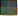

# Venn Diagrams

Program to illustrate data with Venn diagrams. Originally created to show possible coalitions in parliamentary democracies.

# Development
This library uses [Insta](https://docs.rs/insta/latest/insta/index.html) for snapshot tests.